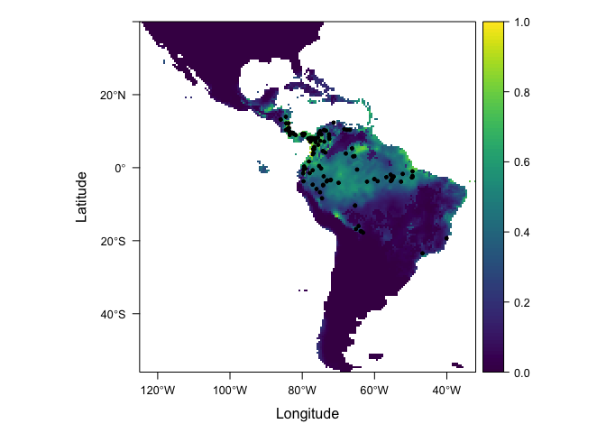
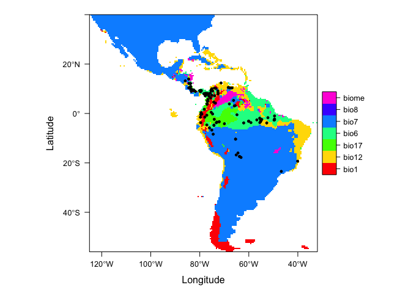

<!-- README.md is generated from README.Rmd. Please edit that file -->

[](https://travis-ci.org/johnbaums/rmaxent)

rmaxent: working with Maxent Species Distribution Models in R	
=============================================================	


(*Please note that some characters and equations do not render correctly in Github Flavored Markdown. Please refer to the [html version](https://rawgit.com/johnbaums/rmaxent/master/README.html) of this document.*)

Correlative species distribution models [SDMs; @Franklin2010a] are now the most common tool for predicting habitat suitability. Maxent, a machine-learning regression-type approach to fitting SDMs based on the principle of maximum entropy [@Elith2011;@Phillips2006;@Phillips2004], is used in a vast proportion of published SDM studies. The Maxent software is written in Java, and provides a graphical user interface in addition to command line operation. In 2010, the `dismo` R package [@Hijmans2016] was added to CRAN, providing, amongst other features, an R interface to Maxent that streamlined the process of preparing data, and fitting, evaluating, and projecting models.

Additional functionality is provided by the `rmaxent` package, which allows Java-free projection of previously-fitted Maxent models, and provides several other convenience functions. The core function of the package is `project`, which builds upon a previous description of the relationship between covariate (i.e., "feature") values and Maxent's fitted values [@Wilson2009]. In my test, projection with the `project` function is at least twice as fast as maxent.jar (the standard Java implementation), and there is scope for further gains by taking advantage of C++ libraries (e.g., via the `Rcpp` package---planned for future releases). These speed gains are of particular use when projecting numerous Maxent models, such as when exploring sensitivity of suitability surfaces to model settings, or when projecting models to numerous environmental scenarios, as is increasingly common when considering potential climate change.

The `rmaxent` package also includes function `ic`, which calculates information criteria (AIC, AIC~c~, BIC) for Maxent models as implemented in ENMTools [@Warren2010]. These quantities can be used to optimise model complexity [e.g., @Warren2011], and for highlighting model parsimony. The user should note, though, that this approach uses the number of parameters (Maxent features with non-zero weights) in place of degrees of freedom when calculating model likelihood, and this may underestimate the true degrees of freedom, particularly when hinge and/or threshold features are in use [see @Warren2014 for details]. However, despite this potential issue, model selection based on this calculation of AIC~c~ has been shown to outperform selection based on predictive capacity [i.e., using AUC; @Warren2011].

Finally, `rmaxent` also provides functions to: 

* import raster data stored in Maxent’s binary .mxe raster format (`read_mxe`; written in collaboration with Peter D. Wilson); 
* parse Maxent .lambdas files (files that contain information about model features), returning information about feature types, weights, minima and maxima, as well as the model’s entropy and other estimated constants (`parse_lambdas`);
* create MESS (multivariate environmental similarity surfaces) maps, MoD (most dissimilar variable) maps, "MoS" (most similar variable) maps (`similarity`); and 
* create limiting factor maps [@Elith2010] that identify the environmental variable that is least favourable at each point across the landscape (`limiting`).


## Installation

We can install the `rmaxent` package from GitHub, using the `devtools` package:


```r
library(devtools)
install_github('johnbaums/rmaxent')
```


```r
library(rmaxent)
```

## Examples

Projecting a fitted Maxent model requires predictor states for all variables included in the model, and the model's ".lambdas" file---a plain text file containing details of all features considered by the model, including their weights (i.e., coefficients), minima, maxima, and some constants required in the calculation of fitted values.

Below, we use the example data distributed with the `dismo` package. These data include coordinates representing localitions where the brown-throated three-toed sloth, _Bradypus variegatus_ has been recorded, and spatial, gridded data giving biome classification and values for a range of current climate variables.


Let's import the _B. variegatus_ occurrence and predictor data from the appropriate paths:


```r
occ_file <- system.file('ex/bradypus.csv', package='dismo')
occ <- read.table(occ_file, header=TRUE, sep=',')[,-1]

library(raster)
pred_files <- list.files(system.file('ex', package='dismo'), '\\.grd$', full.names=TRUE )
predictors <- stack(pred_files)
```

The object `predictors` is a `RasterStack` comprising nine raster layers, one for each predictor used in the model.

We can now fit the model using the `maxent` function from the `dismo` package. Note that this function calls Maxent's Java program, `maxent.jar`. Our objective here is to fit a model in order to demonstrate the functionality of `rmaxent`. For the sake of the exercise we will disable hinge and threshold features. 


```r
library(dismo)
me <- maxent(predictors, occ, factors='biome', args=c('hinge=false', 'threshold=false'))
```

The Maxent model has now been fit, and the resulting object, `me`, which is of class `MaxEnt`, can be passed to various functions in `rmaxent`. For example, `project` takes a trained Maxent model and predicts it to new data. The procedure for calculating fitted values from a Maxent .lambdas file and a vector of predictor values for a given site is as follows:

1. clamp each untransformed predictor to its training extrema (i.e., the maximum and minimum of the model-fitting data), by setting all values greater than the maximum to maximum, and all values less than the minimum to the minimum;
2. considering only non-linear features with non-zero weights (see  description of `parse_lambdas`), take each and calculate its value. For example, if a quadratic feature has a non-zero weight, the quadratic feature's value is the square of the corresponding linear feature;
3. clamp each non-hinge feature to its training extrema, as in step 1;
4. normalise all features so that their values span the range [0, 1]. Maxent's procedure for this depends on the feature type. For each feature $x_j$, the corresponding normalised feature $x_j^\ast$ is calculated as
  
  $$
  \begin{equation} \label{eq:normfeat}
    x_j^\ast=
	\begin{cases}
	  \frac{\text{max}x_j - x_j}{\text{max}x_j - \text{min}x_j},  & \text{if }x_j\text{ is a reverse hinge feature}\\%[1em]
	  \frac{x_j - \text{min}x_j}{\text{max}x_j - \text{min}x_j},  & \text{otherwise}
	\end{cases} 
  \end{equation}
  $$

5. calculate $X^\ast\cdot\beta$, the dot product of the vector of normalised feature values, and the corresponding vector of feature weights;
6. calculate $y_{\text{raw}}$ Maxent's "raw" output by subtracting a normalising constant from $X^\ast\cdot\beta$, exponentiating the result, and dividing by a second normalising constant (these constants are, respectively, the `linearPredictorNormalizer` and `densityNormalizer` returned by `parse_lambdas`); and finally, 
7. calculate Maxent's "logistic" output (often interpreted as habitat suitability, $HS$) as follows, where $H$ is the model entropy (returned by `parse_lambdas`)

$$
\begin{equation} \label{eq:maxentlogistic}
  HS = 1 - \frac{1}{e^H y_{\text{raw}} + 1}.
\end{equation}
$$

Using this procedure, we predict the model to the model-fitting data below:


```r
prediction <- project(me, predictors)
```

And plot the result:


```r
library(rasterVis)
library(viridis)
levelplot(prediction$prediction_logistic, margin=FALSE, col.regions=viridis, at=seq(0, 1, len=100)) +
  layer(sp.points(SpatialPoints(occ), pch=20, col=1))
```



We can compare the time taken to project the model to the model-fitting landscape with `project`, versus using the typical `predict.MaxEnt` method shipped with `dismo`.


```r
library(microbenchmark)
timings <- microbenchmark(
  rmaxent=pred_rmaxent <- project(me, predictors),
  dismo=pred_dismo <- predict(me, predictors), 
  times=10)
```


```r
print(timings, signif=2)
```

```
## Unit: milliseconds
##     expr min  lq mean median  uq max neval
##  rmaxent  55  59   71     62  67 150    10
##    dismo 180 180  210    190 210 260    10
```


On average, the `dismo` method takes approximately 2.9 times as long as the `rmaxent` method. Here the difference is rather trivial, but when projecting to data with higher spatial resolution and/or larger extent, the gains in efficiency are welcome, particularly if projecting many models to multiple environmental scenarios.

We can check that the predictions are equivalent, at least to machine precision:


```r
all.equal(values(pred_rmaxent$prediction_logistic), values(pred_dismo))
```

```
## [1] "Mean relative difference: 0.2073864"
```

It is useful to know that `project` returns a list containing Maxent's raw output as well as its logistic output. The raw output can be accessed with `pred_rmaxent$prediction_raw`, and is required for calculating model information criteria, as we will see when demonstrating the use of `ic`, below.

Once a model has been projected, information about the features used in the model can be extracted from the fitted model object, or the .lambdas file, with `parse_lambdas`. For example,


```r
parse_lambdas(me)
```

```
## 
## Features with non-zero weights
## 
##        feature    lambda    min     max        type
##   (biome==1.0)   1.49227      0       1 categorical
##   (biome==2.0)   1.15527      0       1 categorical
##   (biome==9.0)   2.33123      0       1 categorical
##  (biome==13.0)   1.96180      0       1 categorical
##  (biome==14.0)   0.32250      0       1 categorical
##           bio1   6.60856    -23     289      linear
##          bio16   0.32171      0    2458      linear
##          bio17  -4.08709      0    1496      linear
##           bio7 -16.18362     62     461      linear
##           bio8   1.85855    -66     323      linear
##         bio5^2  -2.16296   3721  178084   quadratic
##         bio6^2  -5.26415      0   57600   quadratic
##         bio7^2  -7.49172   3844  212521   quadratic
##         bio8^2   0.12389      0  104329   quadratic
##     bio12*bio7   4.15357      0  737464     product
##     bio12*bio8   2.44714 -27324 2020366     product
##     bio16*bio8   0.01359 -13332  638038     product
##     bio17*bio7   0.07878      0  145705     product
##      bio5*bio7  -3.27012   8235  162812     product
## 
## 
## Features with zero weights
## 
##  feature lambda  min  max   type
##    bio12      0    0 7682 linear
##     bio5      0   61  422 linear
##     bio6      0 -212  240 linear
```

This information can be useful, since it shows how many, and which, features have non-zero weights. However, the function is perhaps more useful in its role as a helper function for other functions in the package. For example, the values returned by `parse_lambdas` are required for calculating fitted values (shown above).

To identify which variable is most responsible for decreasing suitability in a given environment, we can use the `limiting` function. This is an R implementation of an approach described previously \citep{Elith2010} and now incorporated into Maxent. The limiting variable at a given location is identified by calculating the decrease in suitability, for each predictor in turn, relative to the suitability (logistic prediction) that would be achieved if that predictor took the value equal to the mean at occurrence sites (median for categorical variables). The predictor associated with the largest decrease in suitability is the most limiting factor. 


```r
lim <- limiting(predictors, me)
levelplot(lim, col.regions=rainbow) +
  layer(sp.points(SpatialPoints(occ), pch=20, col=1))
```



Figure 2 shows that for much of the Americas, the BIOCLIM variable 7 (annual temperature range) is most limiting for _B. variegatus_. 

Finally, we can calculate information criteria describing the balance of complexity and fit of the Maxent model. The calculation of these criteria follows that of Warren *et al*. [-@Warren2010]. In the context of Maxent, it has been suggested that likelihood may not be calculated correctly by this approach, since the number of parameters may not be equal to the number of features with non-zero weights [@Hastie2009]. This may lead to underparameterised models \citep{Warren2014}, but relative to other common approaches to SDM selection (e.g., AUC), AIC~c~-based model selection, in particular, has been shown to lead to models with improved transferability, accuracy, and ecological relevance [@Warren2011]. 

Information criteria are typically used as relative measures of model support, thus we will fit and project a second model for comparison to the existing model. The new model will have higher beta-regularisation, permitting a smoother fit to the training data that may be less prone to being locally overfit, but is otherwise identical to the first model. 


```r
me2 <- maxent(predictors, occ, factors='biome', args=c('hinge=false', 'threshold=false', 'betamultiplier=5'))
pred2 <- project(me2, predictors)
```

We can now calculate and compare these quantities using `ic`.


```r
ic(stack(pred_rmaxent$prediction_raw, pred2$prediction_raw), 
   occ, list(me, me2))
```

```
##          n  k        ll      AIC     AICc      BIC
## layer.1 94 19 -736.2354 1510.471 1520.741 1558.793
## layer.2 94  9 -753.9800 1525.960 1528.103 1548.850
```

We see above that AIC~c~, which converges to AIC as $n$ gets large [@Burnham2004], is marginally lower for the simpler model. Difference in the two models could be interrogated further by comparing their results for `parse_lambdas`, and by examining response curves in the standard Maxent output.

## References

[//]: # (Citations styled using the Methods in Ecology and Evolution style 
written by Xiaodong Dang and provided by the Citation Style Language project
under the Creative Commons Attribution-ShareAlike 3.0 Unported license
[http://creativecommons.org/licenses/by-sa/3.0/ license] -
http://citationstyles.org/)
